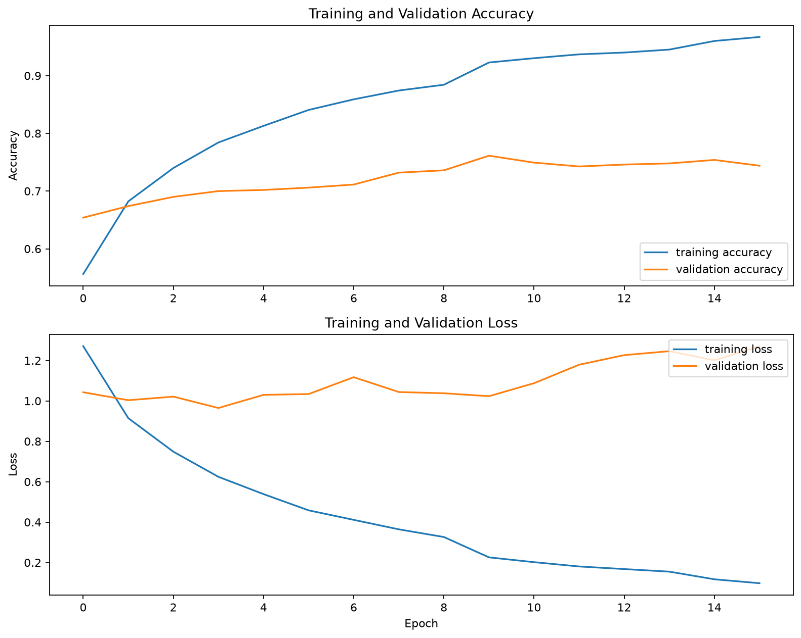
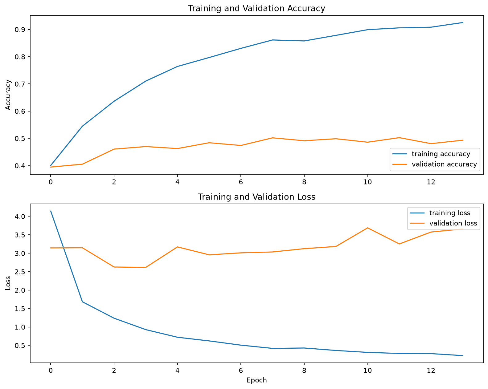

# Music Genre Classification

A music genre classification project built with **Python, TensorFlow and Librosa**, using MFCC audio features and a 1D convolutional neural network to classify music from the GTZAN dataset into 10 genres.

Originally developed as university coursework and later reworked for my portfolio with improved data preparation, evaluation and model architecture.

## Results

| Model                         | Test Accuracy |
| ----------------------------- | ------------: |
| Dense neural network baseline |        44.67% |
| **Improved 1D CNN**           |    **68.00%** |

The original dense model showed significant overfitting. I replaced it with a smaller 1D CNN, normalised the MFCC features and added regularisation techniques to improve performance on unseen tracks.

### Improved Model



### Baseline Model



## How It Works

```text
GTZAN audio tracks
        ↓
Train / Validation / Test split
        ↓
Training-only augmentation
  • White noise
  • Pitch shifting
        ↓
MFCC feature extraction
        ↓
Feature normalisation
        ↓
1D Convolutional Neural Network
        ↓
Genre classification
```

Tracks are split before augmentation so that modified versions of the same song cannot appear in both the training and test sets.

Audio augmentation is applied only to the training data.

## Model

The final model uses:

* 3 Conv1D layers
* Batch normalisation
* Max pooling
* Global average pooling
* Dropout regularisation
* Adam optimiser
* Early stopping
* Adaptive learning rate

The final CNN contains approximately **163,000 parameters**, compared with roughly **2.8 million parameters** in the original dense model.

## Audio Processing

* **Sample rate:** 22,050 Hz
* **MFCC coefficients:** 20
* **FFT size:** 1024
* **Hop length:** 256
* **Segments per track:** 10
* **Augmentation:** White noise and pitch shifting

The model classifies the following genres:

**Blues · Classical · Country · Disco · Hip-Hop · Jazz · Metal · Pop · Reggae · Rock**

## Project Structure

```text
music-genre-classification/
│
├── src/
│   ├── preparing_data.py
│   └── solving_overfitting.py
│
├── results/
│   ├── baseline_metrics.txt
│   ├── baseline_training_history.png
│   ├── improved_metrics.txt
│   └── improved_training_history.png
│
├── requirements.txt
├── .gitignore
└── README.md
```

## Running the Project

### 1. Clone the repository

```bash
git clone https://github.com/LeonKozak/music-genre-classification.git
cd music-genre-classification
```

### 2. Create a virtual environment

On Windows:

```bash
python -m venv .venv
.venv\Scripts\activate
```

### 3. Install dependencies

```bash
python -m pip install -r requirements.txt
```

### 4. Add the GTZAN dataset

Download the **GTZAN Genre Collection** and place the `genres_original` folder inside:

```text
data/
└── genres_original/
    ├── blues/
    ├── classical/
    ├── country/
    ├── disco/
    ├── hiphop/
    ├── jazz/
    ├── metal/
    ├── pop/
    ├── reggae/
    └── rock/
```

The dataset itself is not included in this repository.

### 5. Generate MFCC features

```bash
python src/preparing_data.py
```

This processes the audio, applies augmentation to the training data and generates a compressed local feature file.

### 6. Train and evaluate the model

```bash
python src/solving_overfitting.py
```

The training script evaluates the model against the unseen test set and saves the resulting metrics and training graphs inside the `results` folder.

## Technologies

**Python · TensorFlow/Keras · Librosa · NumPy · Matplotlib · MFCC · CNN · Audio Processing**

## Background

This project originated from university coursework in Music Programming and was later reworked as a portfolio project.

The portfolio version includes improvements to dataset splitting, data augmentation, feature storage, model architecture, reproducibility and evaluation methodology.
